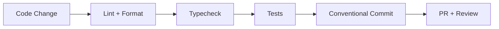

import { Callout, CommandPanel } from "./_components.mdx";

# Engineering Conventions

## Purpose

Define the non-negotiable conventions that keep quality and delivery predictable across the template.

## Scope

- Included: linting, formatting, type safety, commit standards, component conventions.
- Excluded: feature-specific architecture choices (see `lighthouse-architecture.mdx`).

## Quality Pipeline



---

## Code Style — Biome

Biome is the single tool for linting AND formatting. No ESLint, no Prettier.

<CommandPanel
  title="Quality Gates"
  commands={[
    "pnpm lint          # Check all files",
    "pnpm lint:fix      # Auto-fix issues",
    "pnpm format        # Format all files",
    "pnpm typecheck     # TypeScript strict check",
  ]}
/>

**Rules**:
- ✅ Run `pnpm lint` before every commit.
- ✅ All config in `biome.json` at the monorepo root.
- ❌ NEVER add ESLint or Prettier to any package.

---

## Commit Conventions

Use Conventional Commits in English. NEVER add "Co-Authored-By" or AI attribution.

```bash
<type>(<scope>): <description>

# Types:
# feat     — New feature
# fix      — Bug fix
# docs     — Documentation only
# style    — Formatting (no code change)
# refactor — Code restructuring
# perf     — Performance improvement
# test     — Adding tests
# chore    — Maintenance tasks

# Scopes:
# ui, core, contracts, db, ui-lib, docs, config

# Examples:
feat(ui): add streaming chat component
fix(core): prevent stale auth token on refresh
docs: add getting-started guide
chore(config): update Biome to v2.4
refactor(contracts): split auth schemas into separate file
```

---

## Branch Naming

```
<type>/<short-description>

# Examples:
feat/chat-streaming
fix/auth-redirect-loop
docs/developer-guide
chore/update-dependencies
```

---

## TypeScript Strict Rules

- ✅ `strict: true` in all `tsconfig.json`.
- ✅ `noImplicitAny` — no implicit `any` types.
- ❌ NEVER use `@ts-ignore` or `@ts-expect-error` without a tracking comment.
- ❌ NEVER use `as any` type assertions.

### Type Patterns

```typescript
// ✅ DO: Const objects for enum-like values
export const Status = {
  ACTIVE: "active",
  INACTIVE: "inactive",
} as const;
export type Status = (typeof Status)[keyof typeof Status];

// ❌ DON'T: String union types
// type Status = "active" | "inactive"

// ✅ DO: Flat interfaces (one level deep)
interface UserProfile {
  id: string;
  email: string;
  displayName: string;
}

// ❌ DON'T: Nested inline objects
// interface User { profile: { name: string; email: string } }
```

---

## Component Conventions

### Barrel Exports

Every package and shared directory uses barrel exports (`index.ts`):

```typescript
// packages/ui/src/components/index.ts
export { Button } from "./button";
export { Input } from "./input";
export { Dialog } from "./dialog";
```

### cn() Utility

Always use `cn()` from `@template/ui` for conditional classes:

```tsx
import { cn } from "@template/ui/lib/utils";

<div className={cn("base-class", isActive && "active-class")} />
```

### CVA (Class Variance Authority)

Use CVA for components with multiple variants:

```tsx
import { cva, type VariantProps } from "class-variance-authority";

const buttonVariants = cva("inline-flex items-center rounded-md", {
  variants: {
    variant: {
      primary: "bg-primary text-white",
      secondary: "bg-secondary text-black",
    },
    size: {
      sm: "px-2 py-1 text-sm",
      md: "px-4 py-2",
      lg: "px-6 py-3 text-lg",
    },
  },
  defaultVariants: {
    variant: "primary",
    size: "md",
  },
});
```

---

## Testing Strategy Overview

| File Pattern | Runner | Purpose |
|-------------|--------|---------|
| `*.test.ts` / `*.test.tsx` | Vitest | Unit tests, mock-driven integration |
| `*.spec.ts` | Playwright | E2E browser tests |

<Callout title="Rule" tone="warning">
NEVER mix runners. A `.spec.ts` file is ALWAYS Playwright. A `.test.ts` file is ALWAYS Vitest. See `testing-strategy.mdx` for full details.
</Callout>

---

## Pre-Commit Checklist

Before every commit:

- [ ] `pnpm typecheck` passes
- [ ] `pnpm lint` passes
- [ ] No secrets or API keys in code
- [ ] Commit message follows Conventional Commits
- [ ] English for all code and messages

Before opening a PR:

<CommandPanel
  title="Pre-PR Quality Gates"
  commands={[
    "pnpm typecheck",
    "pnpm lint",
    "pnpm test",
  ]}
/>

---

## Decision Log

- **Decision:** Biome is the single formatter + linter tool.
- **Why:** Fast feedback and a unified toolchain simplify local development and CI.
- **Alternatives considered:** ESLint + Prettier (rejected — two tools, more config, slower).

- **Decision:** Conventional Commits enforced, no AI attribution.
- **Why:** Clean git history, consistent changelogs, professional commit log.
- **Alternatives considered:** Free-form commits (rejected — no structure for automation).

## References

- `AGENTS.md`
- `biome.json`
- `package.json`
- `docs/developer-guide/testing-strategy.mdx`
