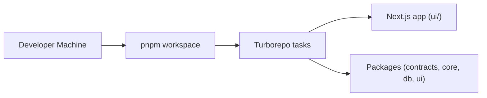

import { Callout, CommandPanel } from "./_components.mdx";

# Getting Started

## Purpose

Provide a repeatable onboarding path for running the startup-saas-template locally with all required tools.

## Scope

- Included: local prerequisites, dependency installation, environment setup, run commands.
- Excluded: deployment, production operations, Supabase cloud configuration.

## Architecture



## Prerequisites

| Tool | Version | Why |
|------|---------|-----|
| **Node.js** | `>=20.0.0` | Runtime |
| **pnpm** | `9.15.0` | Workspace package manager |
| **Git** | Latest | Version control |

<Callout title="No Docker Required" tone="info">
Unlike production setups, the local dev environment does not require Docker. The template ships with a mock auth provider, so no external services are needed to start developing.
</Callout>

## Setup Steps

### 1. Clone the Repository

<CommandPanel
  title="Clone"
  commands={[
    "git clone <repository-url> startup-saas-template",
    "cd startup-saas-template",
  ]}
/>

### 2. Install Dependencies

<CommandPanel title="Install" commands={["pnpm install"]} />

### 3. Configure Environment

<CommandPanel title="Environment" commands={["cp .env.example .env.local"]} />

Edit `.env.local` with your values:

```bash
# Supabase (leave empty for mock auth mode)
SUPABASE_URL=
SUPABASE_ANON_KEY=
SUPABASE_SERVICE_ROLE_KEY=

# App
NEXT_PUBLIC_APP_URL=http://localhost:3000
NEXT_PUBLIC_APP_ENV=development
```

<Callout title="Mock Auth Mode" tone="success">
When Supabase credentials are empty, the app uses the `MockAuthProvider` from `@template/core`. You can log in with any email/password combination for development.
</Callout>

### 4. Start Development Server

<CommandPanel title="Development" commands={["pnpm dev"]} />

This starts all workspace dev servers via Turborepo. The main app runs at `http://localhost:3000`.

### 5. Mock Login Credentials

When running with mock auth (no Supabase configured):

| Field | Value |
|-------|-------|
| Email | `demo@example.com` (or any valid email) |
| Password | `password123` (or any string 8+ chars) |

## Project Structure Overview

```
startup-saas-template/
├── ui/                    # @template/web — Next.js 15 application
│   ├── app/               # App Router routes
│   ├── components/        # Domain-specific UI components
│   ├── hooks/             # Shared React hooks
│   ├── stores/            # Zustand stores
│   └── middleware.ts      # Auth middleware
├── packages/
│   ├── contracts/         # @template/contracts — Zod schemas (DTOs)
│   ├── core/              # @template/core — Auth, Supabase, stores
│   ├── db/                # @template/db — Drizzle schema
│   └── ui/                # @template/ui — shadcn/ui components
├── docs/                  # Developer documentation
├── biome.json             # Linting & formatting config
├── turbo.json             # Turborepo pipeline config
└── pnpm-workspace.yaml    # Workspace definition
```

## Daily Workflow

<CommandPanel
  title="Daily Commands"
  commands={["pnpm dev", "pnpm lint", "pnpm typecheck"]}
/>

## Troubleshooting

| Problem | Solution |
|---------|----------|
| Port 3000 in use | Kill the process: `lsof -ti:3000 \| xargs kill` |
| pnpm install fails | Delete `node_modules` and `pnpm-lock.yaml`, then re-run `pnpm install` |
| TypeScript errors after pull | Run `pnpm typecheck` to see exact issues |
| Package not found | Check `pnpm-workspace.yaml` includes the package directory |

## Decision Log

- **Decision:** Use mock auth as default, Supabase as opt-in.
- **Why:** Removes external service dependency for initial development and evaluation.
- **Alternatives considered:** Require Supabase from the start (rejected — too much friction for onboarding).

## References

- `package.json`
- `.env.example`
- `docs/developer-guide/lighthouse-architecture.mdx`
- `docs/developer-guide/conventions.mdx`
