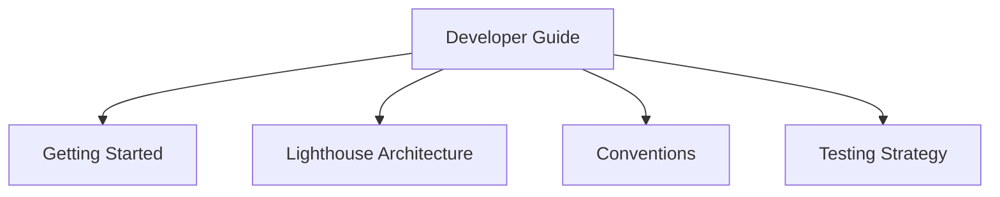

import { Callout, CommandPanel } from "./_components.mdx";

# Developer Guide

## Purpose

Provide a single, reliable starting point for developers working in the startup-saas-template monorepo.

## Scope

- Included: local setup, architecture model, engineering conventions, testing strategy.
- Excluded: product requirements, business process documentation, customer-facing manuals.

## Architecture

The guide is intentionally split by developer workflow: onboarding first, then system understanding, then implementation and quality rules.

## Reading Order

1. [Getting Started](./getting-started.mdx) — Local setup, prerequisites, first run
2. [Lighthouse Architecture](./lighthouse-architecture.mdx) — System architecture, layers, scalability
3. [Conventions](./conventions.mdx) — Code quality, commit standards, Biome
4. [Testing Strategy](./testing-strategy.mdx) — Vitest vs Playwright, test boundaries

<Callout title="Professional Documentation Standard" tone="success">
All developer documentation in this guide is MDX-first, English-only, and follows the same structural contract.
</Callout>

## Quick Start

<CommandPanel
  title="First Run"
  commands={["pnpm install", "cp .env.example .env.local", "pnpm dev"]}
/>

## References

- `README.md`
- `AGENTS.md`
- `docs/developer-guide/getting-started.mdx`
- `docs/developer-guide/lighthouse-architecture.mdx`
- `docs/developer-guide/conventions.mdx`
- `docs/developer-guide/testing-strategy.mdx`
