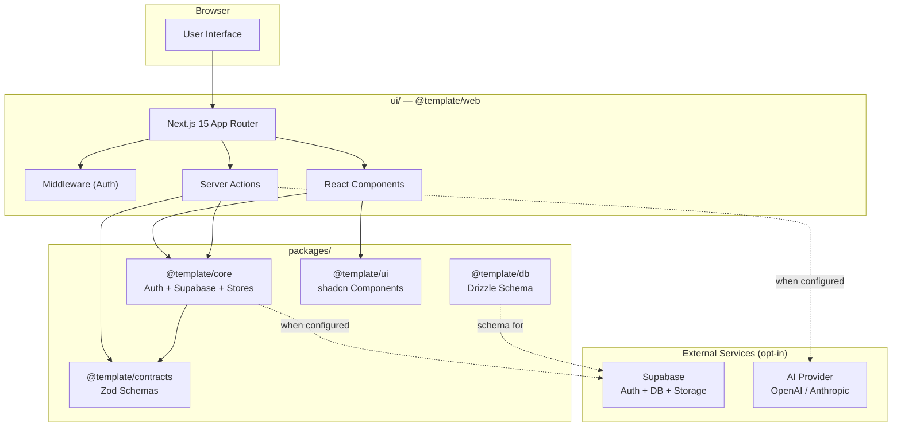
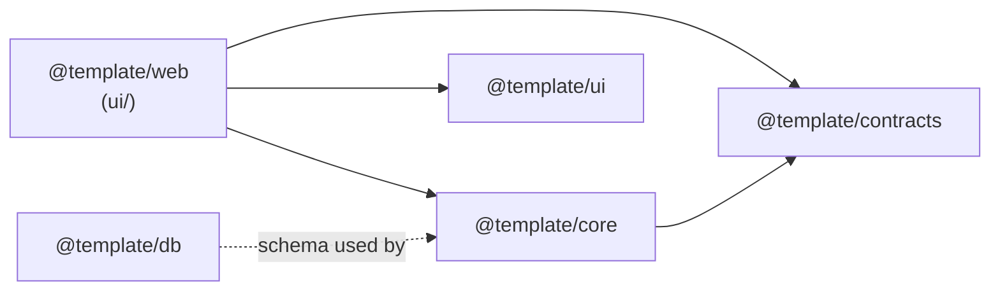

import { Callout, CommandPanel } from "./_components.mdx";

# Lighthouse Architecture — Startup SaaS Template

> **Document Purpose**: This is the **ORCHESTRATOR** document for the startup-saas-template architecture.
> It provides system-wide context, layer responsibilities, and scalability paths.

> **Evaluation Note**: Sections marked `Status: TO BE DEFINED` are intentionally incomplete.
> Missing details are explicitly acknowledged rather than assumed.

---

## System Overview

The startup-saas-template is a **production-ready monorepo** designed for rapid SaaS product development. It provides a fully wired frontend with mock services that can be progressively replaced with real backends (Supabase, Clerk, AI services) without architectural changes.

### Design Philosophy

```
Abstract first → Mock default → Real when ready
```

Every external dependency (auth, database, AI) is accessed through an abstract interface. The template ships with mock implementations so developers can build and evaluate without configuring external services.

---

## High-Level Architecture



---

## Architecture Layers

| Layer | Package | Status | Purpose |
|-------|---------|--------|---------|
| **Frontend** | `ui/` (`@template/web`) | ✅ DEFINED | Next.js 15 App Router application |
| **Contracts** | `packages/contracts/` (`@template/contracts`) | ✅ DEFINED | Zod schemas — shared DTOs |
| **Core** | `packages/core/` (`@template/core`) | ✅ DEFINED | Auth provider (DI), Supabase client, Zustand stores |
| **Database** | `packages/db/` (`@template/db`) | ✅ DEFINED | Drizzle ORM schema definitions |
| **UI Components** | `packages/ui/` (`@template/ui`) | ✅ DEFINED | shadcn/ui + Radix + CVA |
| **Auth** | `packages/core/src/auth/` | ✅ DEFINED | Abstract provider — mock default, Supabase opt-in |
| **Supabase Integration** | `packages/core/src/supabase/` | ⏳ TO BE DEFINED | Client encapsulation — ready to connect |
| **AI Chat** | `ui/app/(app)/chat/` | ✅ DEFINED | AI SDK 5 SSE streaming interface |

---

## Layer Details

### Frontend — `ui/` (`@template/web`)

**Status: ✅ DEFINED** | **Owner: dtaborda**

**Purpose**: User-facing Next.js 15 application with App Router, Server Actions, and streaming support.

**Key Files**:
- `app/(auth)/` — Public routes (login)
- `app/(app)/` — Protected routes (dashboard, chat, portfolio, profile)
- `components/` — Domain-specific UI components
- `hooks/` — Shared React hooks
- `stores/` — Zustand client stores
- `middleware.ts` — Auth guard

**Patterns**:
- React 19 (no useMemo/useCallback — React Compiler)
- Tailwind CSS 4 with cn() utility
- Zustand 5 with useShallow selectors
- Server Actions for mutations
- Server Components by default, "use client" only when needed

**Non-Goals**:
- ❌ No SSG/ISR — all pages are dynamic (SSR or client)
- ❌ No i18n in phase 1
- ❌ No multi-tenant routing

---

### Contracts — `packages/contracts/` (`@template/contracts`)

**Status: ✅ DEFINED** | **Owner: dtaborda**

**Purpose**: Single source of truth for all data shapes. Every API request, response, and form uses schemas defined here.

**Key Files**:
- `src/auth.ts` — Auth schemas (login, signup, user)
- `src/chat.ts` — Chat schemas (messages, sessions)
- `src/common.ts` — Shared primitives (pagination, errors)
- `src/courses.ts` — Course/content schemas

**Patterns**:
- Zod schemas with `Schema` suffix (`LoginRequestSchema`)
- Type inference via `z.infer<typeof Schema>`
- Const enum objects (`as const`) instead of string unions
- Flat file structure — one file per domain

**Non-Goals**:
- ❌ No runtime validation logic beyond schema parsing
- ❌ No dependencies on other internal packages

---

### Core — `packages/core/` (`@template/core`)

**Status: ✅ DEFINED** | **Owner: dtaborda**

**Purpose**: Business logic layer. Encapsulates auth, Supabase client, and shared state.

**Key Files**:
- `src/auth/` — Abstract auth provider with DI pattern
- `src/supabase/` — Supabase client factories (browser, server)
- `src/stores/` — Zustand stores
- `src/utils/` — Shared utilities

**Patterns**:
- **Dependency Injection** for auth: code against `AuthProvider` interface
- **MockAuthProvider** is the default — no external services for dev
- **SupabaseAuthProvider** — opt-in when credentials are configured
- Supabase imports are ONLY allowed in `src/supabase/` and `src/auth/providers/`

**Non-Goals**:
- ❌ No direct Supabase exposure in public API
- ❌ No business domain logic (that belongs in the app layer)

---

### Database — `packages/db/` (`@template/db`)

**Status: ✅ DEFINED** | **Owner: dtaborda**

**Purpose**: Drizzle ORM schema definitions for PostgreSQL.

**Key Files**:
- `src/schema.ts` — All table definitions
- `drizzle.config.ts` — Drizzle Kit configuration

**Patterns**:
- Schema-only package (no queries, no client)
- UUID primary keys with `defaultRandom()`
- `createdAt` / `updatedAt` on every table
- snake_case columns, camelCase TypeScript
- Inferred types: `$inferSelect` and `$inferInsert`

**Non-Goals**:
- ❌ No query execution — queries belong in Server Actions or service layer
- ❌ No `db:push` — always `db:generate` for reviewable migrations

---

### UI Components — `packages/ui/` (`@template/ui`)

**Status: ✅ DEFINED** | **Owner: dtaborda**

**Purpose**: Shared UI primitives based on shadcn/ui, Radix, and CVA.

**Key Files**:
- `src/components/` — shadcn/ui components (Button, Input, Dialog, etc.)
- `src/lib/` — Utilities (cn, etc.)
- `src/styles/` — Global CSS

**Patterns**:
- shadcn/ui components (copy-paste customizable)
- CVA (class-variance-authority) for variant management
- cn() for conditional class merging
- Radix primitives for accessibility

**Non-Goals**:
- ❌ No domain-specific components (those go in `ui/components/`)
- ❌ No external UI libraries (MUI, Chakra, Ant Design)

---

### Auth — Abstract Provider

**Status: ✅ DEFINED** | **Owner: dtaborda**

**Purpose**: Authentication via dependency injection. The system doesn't care WHERE auth comes from.

```
AuthProvider (interface)
├── MockAuthProvider    → In-memory, zero config (DEFAULT)
├── SupabaseAuthProvider → Supabase Auth (opt-in)
└── Future: Clerk, Kinde, NextAuth, etc.
```

**Current State**: Mock auth is active by default. Real Supabase auth activates when `SUPABASE_URL` is configured.

---

### Supabase Integration

**Status: ⏳ TO BE DEFINED** | **Owner: dtaborda**

**Purpose**: Full Supabase integration (Auth, Database, Storage, Realtime).

**Current State**: Client factories exist (`createBrowserClient`, `createServerClient`) but are unused until credentials are configured. The architecture is ready — just add environment variables.

<Callout title="Scalability Path" tone="info">
Supabase integration is a configuration change, not an architectural change. The abstract auth provider, Drizzle schema, and Server Actions are all designed to work with Supabase once credentials are provided.
</Callout>

---

### AI Chat (AI SDK 5)

**Status: ✅ DEFINED** | **Owner: dtaborda**

**Purpose**: AI-powered chat interface using Vercel AI SDK 5 with SSE streaming.

**Key Files**:
- `ui/app/(app)/chat/` — Chat page and route
- `ui/components/chat/` — Chat UI components

**Patterns**:
- `useChat` hook from AI SDK 5
- SSE streaming for real-time responses
- Message history in Zustand store
- Source citations when RAG is enabled

---

## Dependency Graph



**Direction rule**: Dependencies flow inward. `ui/` imports from packages. Packages NEVER import from `ui/`.

---

## Decision Log

| Date | Decision | Rationale |
|------|----------|-----------|
| 2026-03-26 | Abstract auth provider with DI | Allows swapping auth backends without changing app code |
| 2026-03-26 | Mock auth as default | Zero-config development, no external services needed |
| 2026-03-26 | Drizzle for schema, not queries | Schema-only package keeps concerns separated |
| 2026-03-26 | Biome over ESLint + Prettier | Single tool, faster, less config |
| 2026-03-26 | Turborepo for monorepo | Task orchestration, caching, parallel builds |
| 2026-03-26 | shadcn/ui over full component libs | Copy-paste customizable, no vendor lock-in |
| 2026-03-26 | Zod contracts in dedicated package | Single source of truth for all data shapes |

---

## Scalability Paths

### How to Add Supabase

1. Create a Supabase project at [supabase.com](https://supabase.com).
2. Copy credentials to `.env.local`:
   ```bash
   SUPABASE_URL=https://your-project.supabase.co
   SUPABASE_ANON_KEY=your-anon-key
   SUPABASE_SERVICE_ROLE_KEY=your-service-role-key
   ```
3. The `SupabaseAuthProvider` activates automatically when `SUPABASE_URL` is set.
4. Push Drizzle schema to Supabase: use Supabase migrations CLI.
5. Enable RLS policies on all tables.

### How to Add Clerk/Kinde Auth

1. Create a new auth provider implementing the `AuthProvider` interface.
2. Register it in `packages/core/src/auth/providers/`.
3. Update the provider factory to select it based on environment config.
4. No changes needed in `ui/` — the abstract interface handles it.

### How to Connect a Real AI Backend

1. Create an API route in `ui/app/api/chat/route.ts`.
2. Use AI SDK 5's `streamText` with your chosen provider (OpenAI, Anthropic, etc.).
3. Set the API key in `.env.local`.
4. The chat UI (`useChat`) connects automatically via the route handler.

---

## Non-Goals

- ❌ Multi-tenant architecture (phase 1)
- ❌ i18n / localization (phase 1)
- ❌ Self-hosted database (Supabase managed)
- ❌ Mobile native apps
- ❌ Microservices (monolith-first approach)

---

## Document Validation Checklist

- [x] System overview provided
- [x] All packages documented with purpose and patterns
- [x] Dependency graph with direction rules
- [x] Clear "TO BE DEFINED" markers for incomplete layers
- [x] Decision log with rationale
- [x] Scalability paths documented
- [x] Non-goals explicitly stated
- [x] Suitable for senior architectural review

---

## Related Documents

| Document | Purpose |
|----------|---------|
| [`AGENTS.md`](../../AGENTS.md) | Root agent guide |
| [`ui/AGENTS.md`](../../ui/AGENTS.md) | Frontend agent rules |
| [`packages/AGENTS.md`](../../packages/AGENTS.md) | Packages agent rules |
| [`getting-started.mdx`](./getting-started.mdx) | Local setup guide |
| [`conventions.mdx`](./conventions.mdx) | Code quality standards |
| [`testing-strategy.mdx`](./testing-strategy.mdx) | Test runner boundaries |

---

*Last updated: 2026-03-26 | Version: 0.1.0*
