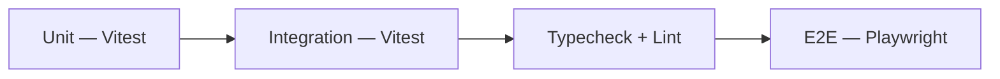

import { Callout, CommandPanel } from "./_components.mdx";

# Testing Strategy

## Purpose

Define one test strategy for the monorepo that removes runner confusion and keeps verification consistent.

## Scope

- Included: unit tests, integration-style tests, E2E tests, command conventions, and test boundaries.
- Excluded: load testing, security pentesting, visual regression testing.

## Test Pipeline



---

## Runner Boundaries

### Vitest (`*.test.ts` / `*.test.tsx`)

- **When**: Pure logic, hooks, utilities, stores, mock-driven integration tests.
- **Where**: Co-located next to the code being tested.
- **Config**: `vitest.config.ts` in each package/app.
- **Excludes**: Playwright specs (`*.spec.ts`) via config.

```
packages/core/src/auth/__tests__/mock-provider.test.ts
packages/contracts/src/__tests__/auth-schemas.test.ts
ui/hooks/__tests__/use-auth.test.ts
ui/stores/__tests__/chat-store.test.ts
```

### Playwright (`*.spec.ts`)

- **When**: Browser behavior, route navigation, form submissions, API responses.
- **Where**: Dedicated test directory (`ui/tests/` or `tests/`).
- **Config**: `playwright.config.ts` at root or in `ui/`.

```
ui/tests/auth/login.spec.ts
ui/tests/chat/send-message.spec.ts
ui/tests/dashboard/load.spec.ts
```

<Callout title="Rule" tone="danger">
NEVER run Playwright specs with Vitest. NEVER run Vitest tests with Playwright. Keep `.spec.ts` exclusively for Playwright and `.test.ts` exclusively for Vitest.
</Callout>

---

## Test File Co-location

Tests live next to the code they test (Vitest) or in a dedicated directory (Playwright):

```
# ✅ Unit tests — co-located
packages/core/src/auth/
├── types.ts
├── providers/
│   ├── mock.ts
│   └── mock.test.ts          ← Vitest

# ✅ E2E tests — dedicated directory
ui/tests/
├── auth/
│   └── login.spec.ts         ← Playwright
└── chat/
    └── streaming.spec.ts     ← Playwright

# ❌ NEVER: .spec.ts next to components
# ui/components/chat/chat-input.spec.ts  ← WRONG
```

---

## Mock Patterns

### Vitest Mocks

```typescript
// ✅ Mock a module
import { vi, describe, it, expect } from "vitest";

vi.mock("@template/core/auth", () => ({
  useAuth: () => ({
    user: { id: "1", email: "test@example.com" },
    isAuthenticated: true,
  }),
}));

// ✅ Mock a function
const mockLogin = vi.fn().mockResolvedValue({ success: true });
```

### Playwright Fixtures

```typescript
// ✅ Custom fixture for authenticated state
import { test as base } from "@playwright/test";

const test = base.extend({
  authenticatedPage: async ({ page }, use) => {
    // Set auth cookies/tokens
    await page.goto("/login");
    await page.fill('[name="email"]', "demo@example.com");
    await page.fill('[name="password"]', "password123");
    await page.click('button[type="submit"]');
    await page.waitForURL("/dashboard");
    await use(page);
  },
});
```

---

## Verification Order

When verifying a feature is complete, run in this order:

<CommandPanel
  title="Full Verification"
  commands={[
    "pnpm typecheck       # 1. Types pass",
    "pnpm lint            # 2. Linting passes",
    "pnpm test            # 3. Unit tests pass",
    "pnpm test:e2e        # 4. E2E tests pass (if configured)",
  ]}
/>

---

## Commands Reference

| Command | Runner | Scope |
|---------|--------|-------|
| `pnpm test` | Vitest | All packages (via Turborepo) |
| `pnpm test:e2e` | Playwright | Browser tests |
| `pnpm test --filter @template/core` | Vitest | Core package only |
| `pnpm typecheck` | TypeScript | All packages |
| `pnpm lint` | Biome | All files |

---

## Decision Log

- **Decision:** Separate Vitest and Playwright by file convention and config-level include/exclude.
- **Why:** Prevents false failures where browser-oriented specs execute under a unit-test runner.
- **Alternatives considered:** Single-runner strategy for all tests (rejected — fundamentally different execution contexts).

- **Decision:** Co-locate unit tests, dedicate E2E directory.
- **Why:** Unit tests benefit from proximity to source. E2E tests span multiple components and routes.
- **Alternatives considered:** All tests in a single `__tests__` directory (rejected — doesn't scale).

## References

- `vitest.config.ts`
- `playwright.config.ts`
- `package.json`
- `docs/developer-guide/conventions.mdx`
