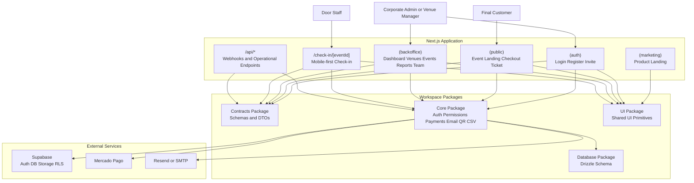
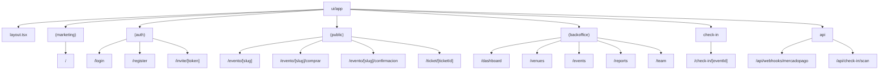
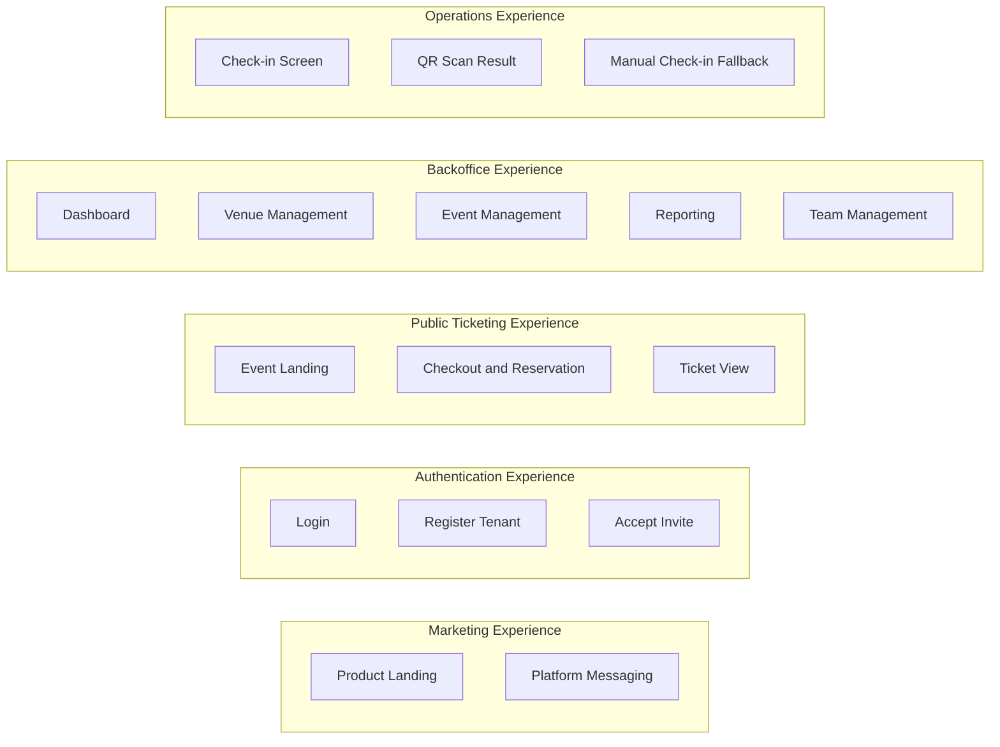
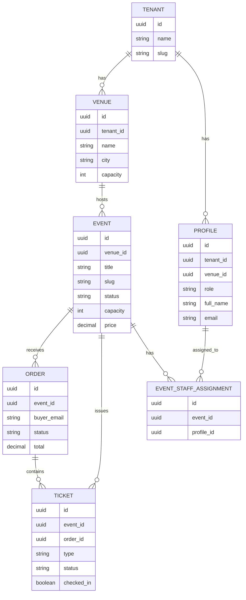
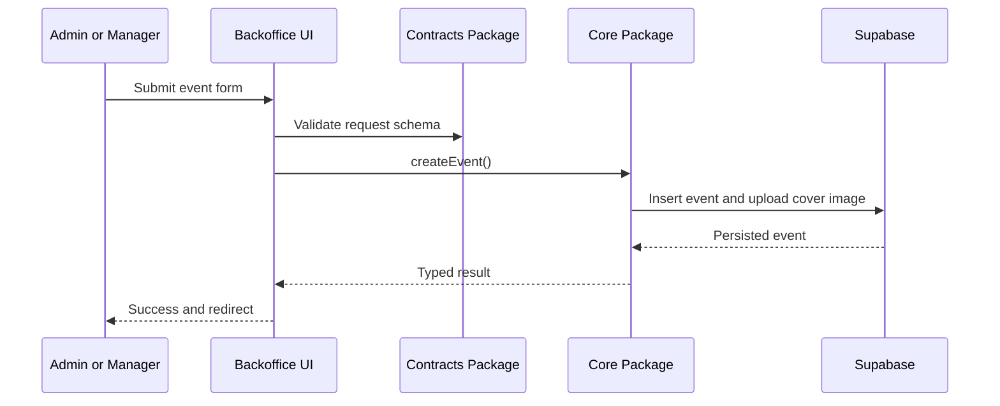
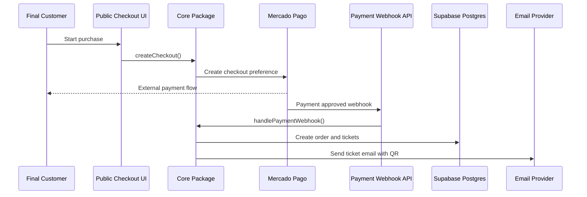
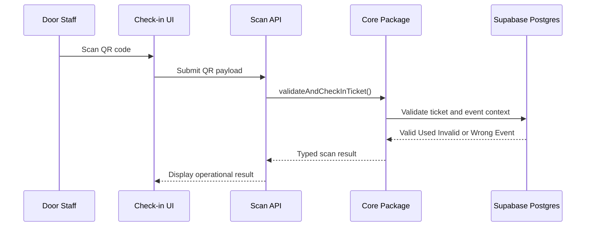
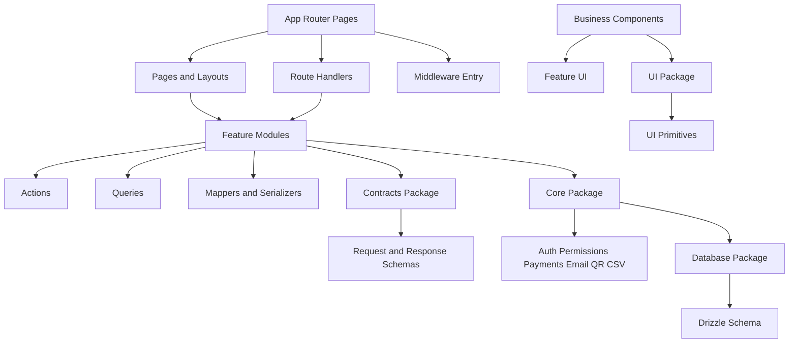

# SalaTicket Monorepo Architecture Blueprint

## Purpose

This document defines the target monorepo architecture for building the SalaTicket MVP on top of startup-saas-template.

It answers three questions:

* What the application looks like at a system level
* How the Next.js application is organized by user experience and route groups
* How the repository should be scaffolded file by file to support the MVP and future scale

## Scope

This document covers:

* The target runtime architecture
* The route group strategy for the Next.js App Router
* The workspace package responsibilities
* The recommended repository scaffolding for `ui/`, `packages/contracts/`, `packages/core/`, `packages/db/`, and `packages/ui/`
* The main business flows: backoffice event management, public checkout, and door check-in

This document does not cover:

* Detailed database DDL or migration SQL
* UI mockups or visual design decisions
* Full API payload definitions for every feature
* Release, deployment, or infrastructure automation

## Architecture

### System Overview



### Route Group Topology

Route groups exist to organize the application and share layouts. They do not change the URL and they do not enforce authentication by themselves.



### Application Zones



### Domain Model



### Runtime Flows

#### Backoffice Event Creation Flow



#### Paid Checkout Flow



#### Door Check-in Flow



## Implementation

### Target Repository Scaffolding

```text
startup-saas-template/
├── docs/
│   ├── developer-guide/
│   └── tickets/
│       └── salaticket-monorepo-architecture.md
├── ui/
│   ├── app/
│   ├── components/
│   ├── modules/
│   ├── hooks/
│   ├── stores/
│   ├── lib/
│   └── types/
└── packages/
    ├── contracts/
    ├── core/
    ├── db/
    └── ui/
```

### File-by-File Blueprint

#### `ui/` — Next.js Application

```text
ui/
├── middleware.ts
├── app/
│   ├── layout.tsx
│   ├── (marketing)/
│   │   ├── layout.tsx
│   │   └── page.tsx
│   ├── (auth)/
│   │   ├── layout.tsx
│   │   ├── login/page.tsx
│   │   ├── register/page.tsx
│   │   └── invite/[token]/page.tsx
│   ├── (public)/
│   │   ├── evento/[slug]/page.tsx
│   │   ├── evento/[slug]/comprar/page.tsx
│   │   ├── evento/[slug]/confirmacion/page.tsx
│   │   └── ticket/[ticketId]/page.tsx
│   ├── (backoffice)/
│   │   ├── layout.tsx
│   │   ├── dashboard/page.tsx
│   │   ├── venues/page.tsx
│   │   ├── venues/new/page.tsx
│   │   ├── venues/[venueId]/page.tsx
│   │   ├── venues/[venueId]/edit/page.tsx
│   │   ├── events/page.tsx
│   │   ├── events/new/page.tsx
│   │   ├── events/[eventId]/page.tsx
│   │   ├── events/[eventId]/edit/page.tsx
│   │   ├── events/[eventId]/tickets/page.tsx
│   │   ├── events/[eventId]/courtesies/page.tsx
│   │   ├── events/[eventId]/reports/page.tsx
│   │   ├── reports/page.tsx
│   │   └── team/page.tsx
│   ├── check-in/
│   │   └── [eventId]/page.tsx
│   └── api/
│       ├── health/route.ts
│       ├── check-in/scan/route.ts
│       └── webhooks/mercadopago/route.ts
├── components/
│   ├── layout/
│   ├── shared/
│   ├── auth/
│   ├── venues/
│   ├── events/
│   ├── checkout/
│   ├── tickets/
│   ├── check-in/
│   └── reports/
├── modules/
│   ├── auth/
│   ├── tenancy/
│   ├── venues/
│   ├── events/
│   ├── checkout/
│   ├── tickets/
│   ├── check-in/
│   └── reports/
├── hooks/
├── stores/
├── lib/
└── types/
```

#### `ui/modules/` — Application Logic by Feature

Each feature module owns the application-specific actions, queries, mappers, serializers, and utilities for that domain.

```text
ui/modules/
├── auth/
│   ├── actions/
│   │   ├── login.ts
│   │   ├── register-tenant.ts
│   │   └── accept-invite.ts
│   ├── queries/
│   │   └── get-session-user.ts
│   ├── guards/
│   │   ├── require-session.ts
│   │   └── require-role.ts
│   └── utils/
│       └── post-login-redirect.ts
├── tenancy/
│   ├── queries/
│   │   ├── get-current-tenant.ts
│   │   └── get-current-scope.ts
│   └── utils/
│       └── tenant-scope.ts
├── venues/
│   ├── actions/
│   │   ├── create-venue.ts
│   │   ├── update-venue.ts
│   │   └── deactivate-venue.ts
│   ├── queries/
│   │   ├── list-venues.ts
│   │   └── get-venue-by-id.ts
│   └── mappers/
│       └── venue-list-item.ts
├── events/
│   ├── actions/
│   │   ├── create-event.ts
│   │   ├── update-event.ts
│   │   ├── publish-event.ts
│   │   ├── cancel-event.ts
│   │   └── archive-event.ts
│   ├── queries/
│   │   ├── list-events.ts
│   │   ├── get-event-by-id.ts
│   │   └── get-event-by-slug.ts
│   ├── mappers/
│   │   ├── event-form-defaults.ts
│   │   └── event-status-badge.ts
│   └── serializers/
│       └── event-public-view.ts
├── checkout/
│   ├── actions/
│   │   ├── create-free-reservation.ts
│   │   └── create-paid-checkout.ts
│   ├── queries/
│   │   └── get-checkout-summary.ts
│   ├── services/
│   │   └── enforce-capacity.ts
│   └── utils/
│       └── ticket-quantity.ts
├── tickets/
│   ├── actions/
│   │   ├── issue-courtesy.ts
│   │   └── resend-ticket-email.ts
│   ├── queries/
│   │   ├── list-event-tickets.ts
│   │   └── get-ticket-by-id.ts
│   └── services/
│       └── build-ticket-view-model.ts
├── check-in/
│   ├── actions/
│   │   └── manual-check-in.ts
│   ├── queries/
│   │   ├── list-attendees.ts
│   │   └── get-check-in-counter.ts
│   └── services/
│       └── scan-ticket.ts
└── reports/
    ├── queries/
    │   ├── get-event-report.ts
    │   ├── get-venue-report.ts
    │   └── get-consolidated-report.ts
    └── serializers/
        └── report-summary.ts
```

#### `packages/contracts/` — Shared Schemas

```text
packages/contracts/src/
├── index.ts
├── common.ts
├── auth.ts
├── tenancy.ts
├── venues.ts
├── events.ts
├── orders.ts
├── tickets.ts
├── checkin.ts
├── reports.ts
└── payments.ts
```

Recommended responsibilities:

* `auth.ts`: login, register, invite acceptance, session user
* `tenancy.ts`: tenant, profile, role, and scope schemas
* `venues.ts`: create, update, list, and detail view schemas
* `events.ts`: create, update, publish, cancel, and public event view schemas
* `orders.ts`: reservation and order lifecycle schemas
* `tickets.ts`: ticket, courtesy issuance, and public ticket view schemas
* `checkin.ts`: QR validation, scan result, and manual check-in schemas
* `reports.ts`: report filters and aggregate response schemas
* `payments.ts`: checkout request, checkout result, and normalized webhook schemas

#### `packages/core/` — Cross-Cutting Infrastructure and Adapters

```text
packages/core/src/
├── index.ts
├── auth/
│   ├── provider.ts
│   ├── types.ts
│   ├── mock-provider.ts
│   └── supabase-provider.ts
├── permissions/
│   ├── roles.ts
│   ├── ability.ts
│   └── guards.ts
├── supabase/
│   ├── client.ts
│   ├── server.ts
│   └── middleware.ts
├── payments/
│   ├── provider.ts
│   ├── mercadopago.ts
│   └── types.ts
├── email/
│   ├── provider.ts
│   ├── resend.ts
│   └── types.ts
├── tickets/
│   ├── qr.ts
│   ├── signer.ts
│   └── parser.ts
├── csv/
│   └── export.ts
├── stores/
└── utils/
```

Responsibility rules:

* `core` provides capabilities such as permissions, payments, email, QR, CSV, and Supabase access
* `core` does not own feature orchestration such as `publish-event.ts` or `issue-courtesy.ts`
* Feature orchestration stays in `ui/modules/*`

#### `packages/db/` — Schema Only

```text
packages/db/src/
├── index.ts
└── schema.ts
```

MVP-first tables:

* `tenants`
* `profiles`
* `venues`
* `events`
* `orders`
* `tickets`
* `event_staff_assignments`
* `webhook_events` for idempotency

#### `packages/ui/` — Shared UI Primitives

```text
packages/ui/src/
├── index.ts
├── components/
│   ├── button.tsx
│   ├── input.tsx
│   ├── card.tsx
│   ├── dialog.tsx
│   ├── table.tsx
│   ├── badge.tsx
│   ├── tabs.tsx
│   └── sidebar.tsx
├── lib/
└── styles/
```

Rule of thumb:

* `packages/ui` owns primitives
* `ui/components/*` owns business components such as `event-form.tsx`, `ticket-card.tsx`, or `scan-result.tsx`

### Concrete File Ownership Diagram



### Route Groups and Authentication Boundaries

Route groups are organizational and layout boundaries only.

| Route Group | URL Impact | Primary Purpose | Typical Auth State |
|------------|------------|-----------------|--------------------|
| `(marketing)` | None | Product marketing pages | Public |
| `(auth)` | None | Login, registration, invite acceptance | Public or redirect if logged in |
| `(public)` | None | Event landing, checkout, ticket lookup | Public |
| `(backoffice)` | None | Internal management console | Authenticated and role-based |
| `check-in` | Normal segment | Fast operational experience | Authenticated and scope-based |

Authentication and authorization must be enforced through middleware, server-side guards, and role checks. Folder names do not provide security.

## Operational Playbook

### How To Read This Blueprint

1. Start with **System Overview** to understand the main layers.
2. Read **Route Group Topology** to understand the application surface.
3. Use **File-by-File Blueprint** as the implementation scaffolding.
4. Build features in this order:
   * auth and tenancy
   * venues
   * events
   * checkout
   * tickets
   * check-in
   * reports

### Recommended Commands

```bash
pnpm lint
pnpm typecheck
pnpm test
```

### Scaffolding Guardrails

* Keep `ui/` as the only application for the MVP
* Add new business data shapes only in `@template/contracts`
* Keep database definitions in `@template/db` only
* Keep infrastructure adapters in `@template/core`
* Keep feature orchestration in `ui/modules/*`
* Keep route groups focused on layout and user experience, not security

## Decision Log

| Date | Decision | Rationale |
|------|----------|-----------|
| 2026-04-06 | Keep a single Next.js app for the MVP | Reduces delivery overhead while preserving a scaling path |
| 2026-04-06 | Use shared workspace packages for contracts, core, db, and UI primitives | Prevents schema drift and keeps infrastructure reusable |
| 2026-04-06 | Organize the App Router with `(marketing)`, `(auth)`, `(public)`, and `(backoffice)` | Separates user experiences and shared layouts without polluting URLs |
| 2026-04-06 | Keep `check-in` outside `(backoffice)` | Allows a fast, mobile-first operational flow with dedicated constraints |
| 2026-04-06 | Keep feature orchestration in `ui/modules/*` | Prevents `app/` from becoming a dumping ground for business logic |

## References

* `docs/developer-guide/lighthouse-architecture.mdx`
* `AGENTS.md`
* `ui/AGENTS.md`
* `packages/AGENTS.md`
